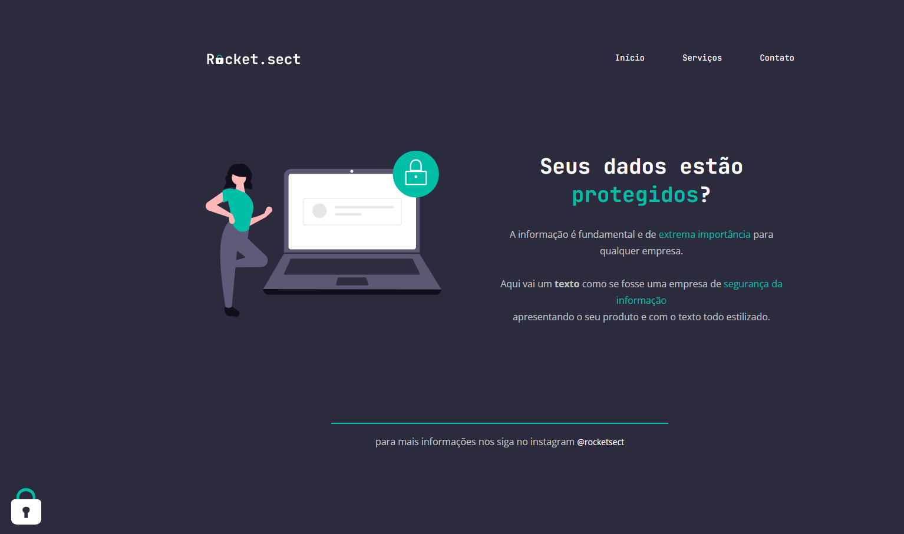

# #explore-bonus-challenge-2

## Project Overview

Welcome to "#explore-bonus-challenge-2" – my personal endeavor in the Web Layout Recreation Challenge. This project is a testament to minimalist yet effective web development, focusing on using core web technologies.

The challenge was to recreate a web layout provided in a Figma design, using only semantic HTML and Flexbox CSS. No frameworks were employed in this endeavor, highlighting a back-to-basics approach in web design and development.

This project not only demonstrates my skills in accurately translating designs into functional web layouts but also underscores the importance of understanding fundamental web technologies.

### Design Reference

The layout was replicated from a design provided on Figma. You can view the original design [here](https://www.figma.com/file/EdKjPWjC8ZlbnH4XzTObv2/Explorer/duplicate).

## Project Structure

The repository is organized into the following files and folders:

- `index.html`: The main HTML file.
- `style.css`: The CSS file used for styling the web layout.
- `/images`: A folder containing all the images used in the project, including `project.png` which is a snapshot of the final layout.

## Preview

Below is a preview of the completed web layout:



## Getting Started

To get a local copy up and running, follow these simple steps:

1. Clone the repo
   ```sh
   git clone https://github.com/giovannivicentin/explore-bonus-challenge-2.git
   ```
2. Navigate to the project directory
3. Open `index.html` in your browser to view the project.

## Contributing

Contributions are what make the open-source community such an amazing place to learn, inspire, and create. Any contributions you make are **greatly appreciated**.

If you have a suggestion that would make this better, please fork the repo and create a pull request. You can also simply open an issue with the tag "enhancement".

Don't forget to give the project a star! Thanks again!

## License

Distributed under the MIT License. See `LICENSE` for more information.
